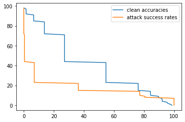

# ML_CyberSec_Lab2
Lab 2 for ML In Cybersecurity  

## I. Folder Structure
lab2  
 ┣ .ipynb_checkpoints  
 ┣ B_prime_10p  
 ┣ B_prime_2p  
 ┣ B_prime_4p  
 ┣ data  
 ┃ ┣ bd  
 ┃ ┃ ┣ bd_test.h5  
 ┃ ┃ ┗ bd_valid.h5  
 ┃ ┗ cl  
 ┃ ┃ ┣ test.h5  
 ┃ ┃ ┗ valid.h5  
 ┣ Lab2_aag9131.ipynb  
 ┣ bd_net.h5  
 ┗ bd_weights.h5  

## II. Dependencies
   1. Python 3.6.9
   2. Keras 2.3.1
   3. Numpy 1.16.3
   4. Matplotlib 2.2.2
   5. H5py 2.9.0
   6. TensorFlow-gpu 1.15.2
   
## III. Data
   1. Download the validation and test datasets from [this link](https://drive.google.com/drive/folders/1Rs68uH8Xqa4j6UxG53wzD0uyI8347dSq?usp=sharing) and store them under `data/` directory under the lab2 folder.
   2. The dataset contains images from YouTube Aligned Face Dataset. We retrieve 1283 individuals and split into validation and test datasets.
   3. bd_valid.h5 and bd_test.h5 contains validation and test images with sunglasses trigger respectively, that activates the backdoor for bd_net.h5. 
 
## IV. Results
The B_Prime models are stores as B_Prime_2p for 2%, B_Prime_4p for 4% and B_Prime_10p for 10%.  
  
The below graph shows the obtained result as the comparison of attack success rate and test accuracies on varying the fraction of pruned channels.  
  
